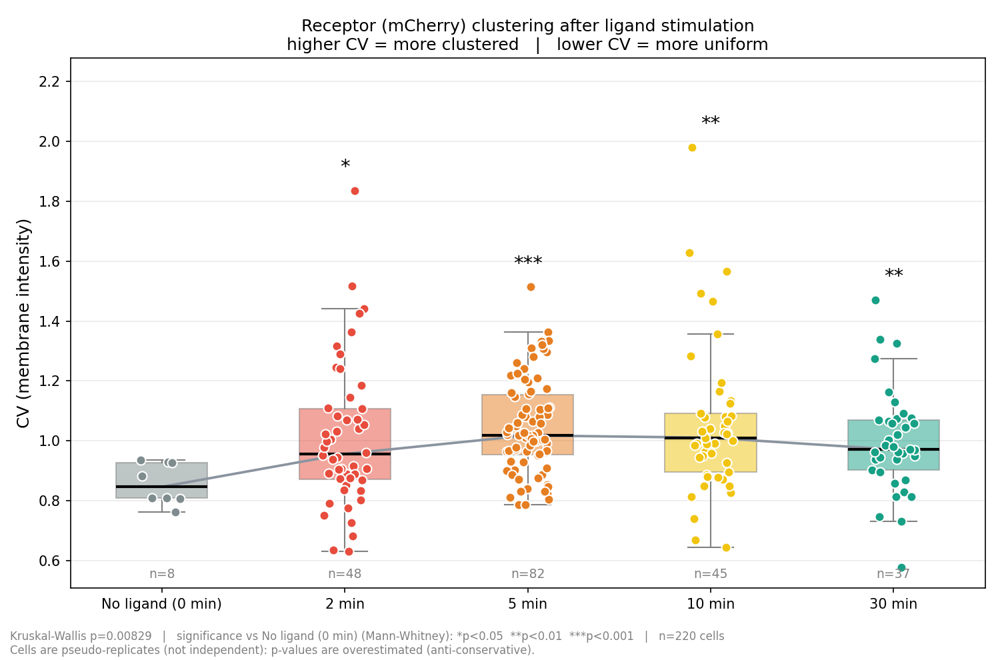

# Receptor clustering analysis (mCherry-tagged receptor, confocal)

Ligand 자극 후 시간에 따라 mCherry가 붙은 receptor가 세포막에서 **얼마나 뭉치는지(aggregation)** 를
confocal 이미지(`.czi`)에서 정량하는 파이프라인.

- 세포 모양이 원형이 아닌 attached cell → **세포 모양 자동 감지 모듈** (`segmentation.py`)
- 세포막 intensity의 들쭉날쭉한 정도 → **clustering 정량 모듈** (`clustering.py`, CV)



## 지표: CV (Coefficient of Variation)

세포 외곽선(membrane)을 따라 intensity profile을 뽑고

```
CV = SD / (Membrane_Mean - Background)
```

- receptor가 막 전체에 고르게 퍼져 있으면 profile이 평평 → **CV 낮음**
- 특정 부위에 뭉치면 profile이 뾰족 → **CV 높음**
- 평균으로 나누므로 발현량(밝기) 차이가 자동 보정됨

## 분석 흐름

| 단계 | 내용 | 코드 |
|---|---|---|
| 1 | CZI 로딩 (receptor = ch0 R-PE/mCherry, 핵 = ch2 DAPI, 픽셀 크기는 메타데이터에서) | `io.py` |
| 2 | z-mean projection → Gaussian → Li threshold → hole fill. 붙어 있는 세포는 **DAPI 핵을 seed로 watershed** 분리. 이미지 가장자리에 걸친 세포는 제외 | `segmentation.py` |
| 3 | 세포마다 **적도면(equator) z 선택**: 핵 신호가 가장 센 z (±1 plane 평균으로 shot noise 감소). 아래쪽 2 plane은 glass glare라 제외 | `clustering.py` |
| 4 | background = 세포에서 2 µm 이상 떨어진 픽셀의 median (자동, 수동 ROI 불필요) | `clustering.py` |
| 5 | 세포 마스크 외곽선을 1 px 간격으로 따라가며 ±0.8 µm 폭의 band 평균 → 1D profile → Mean, SD, CV | `clustering.py` |
| 6 | 세포별 그림, 전체 표, 그룹 통계, 최종 그래프 | `plotting.py`, `pipeline.py` |

## 사용법

```bash
pip install -r requirements.txt
# .czi 파일을 data/raw/ 에 넣거나 --data-dir 로 폴더 지정
python scripts/run_analysis.py --data-dir data/raw
```

옵션: `--receptor-channel 0`, `--nuclear-channel 2` (`-1` 이면 핵 없이 distance-map으로 분리), `--band-um 0.8`, `--out results`.
이미지 → 조건 매핑은 [`metadata/samples.csv`](metadata/samples.csv) 에서 수정.

> **확인 필요**: 파일명 접두사(1, 2, 3, 5, 6) → 0(no ligand) / 2 / 5 / 10 / 30 min 매핑은
> 파일 개수와 세포 수를 보고 추정한 것입니다. 실제와 다르면 `samples.csv` 만 고치면 됩니다.

## 결과물 (`results/`)

| 파일 | 설명 |
|---|---|
| `per_cell/{image}_cell{NN}.png` | **세포마다 1장**: 추적한 외곽선(왼쪽) + 외곽선을 따라간 intensity profile (Gray Value vs Distance, µm) |
| `cell_table.xlsx` / `.csv` | **모든 이미지·모든 세포 통합 표**: `Image, Cell, Membrane_Mean, SD, Background, Signal, CV` (+ Condition, Time_min, Z_plane, Perimeter_um, Area_um2) |
| `segmentation_qc/{image}.png` | 세포 감지 확인용 (외곽선 + 세포 번호) |
| `group_stats.csv` | 그룹별 n, median CV, control 대비 Mann-Whitney p |
| `cv_boxplot.png` | 최종 그래프 |

## 통계 해석 시 주의: p-value는 과대평가(overestimated)되어 있음

그래프의 유의성(Kruskal-Wallis, control 대비 Mann-Whitney U)은 **세포 한 개 = 독립 시행 1회** 로 놓고 계산한 값입니다.
하지만 같은 이미지(field)·같은 dish의 세포들은 서로 독립이 아니라 **pseudoreplication** 입니다
(같은 배양 조건, 같은 자극 타이밍, 같은 염색/촬영 조건을 공유하고, 이웃 세포끼리 서로 영향도 줌).
그 결과 유효 표본 수가 실제보다 크게 계산되어 **p-value가 실제보다 작게(anti-conservative) 나옵니다.**
따라서 `*`, `**`, `***` 는 탐색적 지표로만 읽어야 하고, 엄밀한 검정은 독립 실험(biological replicate, dish/well) 단위로 반복 실험 후
평균을 단위로 하거나 mixed-effects model(random effect = image/dish)로 해야 합니다.
또한 no-ligand control은 이미지 2장(세포 8개)뿐이라 더욱 조심해서 봐야 합니다.

## 알려진 한계

- 이 데이터는 photon 수가 적어 단일 plane이 noisy → CV의 절대값에 shot noise가 들어감. 조건 간 **상대 비교**로 사용할 것.
  (공정 비교를 위해 모든 조건에 같은 파라미터를 적용함.)
- 자동 감지는 초점이 안 맞는 흐린 세포를 놓칠 수 있고, 수동으로 고른 세포 집합과 n이 다름(자동: 모든 감지 세포).
  `segmentation_qc/` 에서 확인하고 필요하면 `segment_cells()` 의 threshold/크기 파라미터 조정.
- 세포 마스크가 z에 따라 변하지 않는다고 가정(적도면 근처에서는 충분히 유효).
