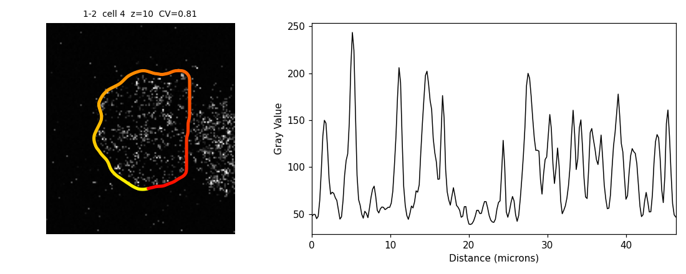
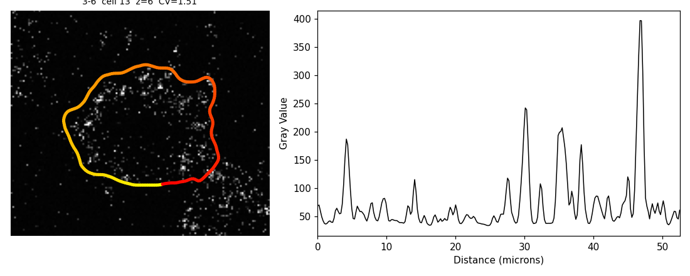

# Receptor clustering analysis (mCherry-tagged receptor, confocal)

A pipeline that quantifies how strongly an mCherry-tagged receptor **aggregates on the plasma membrane**
over time after ligand stimulation, from confocal z-stacks (`.czi`).

- Adherent cells have irregular, non-circular shapes → **cell shape detection module** (`segmentation.py`)
- How patchy the membrane signal is → **clustering quantification module** (`clustering.py`, CV)


## Metric: CV (coefficient of variation)

The intensity profile is sampled along each cell outline (membrane), and

```
CV = SD / (Membrane_Mean - Background)
```

- Receptor evenly spread over the membrane → flat profile → **low CV**
- Receptor concentrated in patches/aggregates → peaky profile → **high CV**
- Dividing by the mean corrects for differences in expression level (brightness).

## Pipeline

| Step | What it does | Code |
|---|---|---|
| 1 | Load CZI (receptor = ch0 R-PE/mCherry, nuclei = ch2 DAPI; pixel size read from metadata) | `io.py` |
| 2 | z-mean projection → Gaussian smoothing → Li threshold → hole filling. Touching cells are split by a **watershed seeded with DAPI nuclei**. Cells touching the image border are excluded | `segmentation.py` |
| 3 | For each cell, pick the **equatorial z-plane**: the plane where the nuclear signal peaks, averaged with ±1 plane to reduce shot noise. The lowest 2 planes (glass glare) are never used | `clustering.py` |
| 4 | Background = median of pixels ≥ 2 µm away from any detected cell (automatic, no manual ROI) | `clustering.py` |
| 5 | Trace the cell mask outline at 1 px spacing, average across a ±0.8 µm band → 1D profile → Mean, SD, CV | `clustering.py` |
| 6 | Per-cell figures, pooled table, group statistics, final plot | `plotting.py`, `pipeline.py` |

## Usage

```bash
pip install -r requirements.txt
# put the .czi files in data/raw/ (or point --data-dir at their folder)
python scripts/run_analysis.py --data-dir data/raw
```

Options: `--receptor-channel 0`, `--nuclear-channel 2` (`-1` = no nuclear channel, split cells by distance map instead),
`--band-um 0.8`, `--out results`.
The image → condition mapping is defined in [`metadata/samples.csv`](metadata/samples.csv); edit it for your own data.

Raw `.czi` files are not tracked in git (~40 MB each, see `.gitignore`).

## Example cells

| No ligand (CV 0.81) | 5 min (CV 1.51) |
|---|---|
|  |  |

## Outputs (`results/`)

| File | Description |
|---|---|
| `per_cell/{image}_cell{NN}.png` | **One figure per cell**: traced outline (left) + intensity profile along the outline (Gray Value vs Distance in µm) |
| `cell_table.xlsx` / `.csv` | **Pooled table of every cell from every image**: `Image, Cell, Membrane_Mean, SD, Background, Signal, CV` (+ `Condition, Time_min, Z_plane, Perimeter_um, Area_um2`) |
| `segmentation_qc/{image}.png` | Cell detection check (outlines + cell numbers) |
| `group_stats.csv` | Per group: n, median CV, Mann-Whitney p vs control |
| `cv_boxplot.png` | Final figure |

## Statistical caveat: the p-values are overestimated

Significance in the figure (Kruskal-Wallis across groups, Mann-Whitney U vs the no-ligand control) treats
**each cell as an independent observation**. It is not: cells from the same image/field/dish share the same
culture, stimulation timing, staining and imaging conditions, and neighbouring cells influence each other.
This is **pseudoreplication**. The effective sample size is therefore much smaller than the number of cells,
and the reported **p-values are overestimated (too small, anti-conservative)**.

Read the `*`, `**`, `***` as exploratory. A rigorous test needs independent biological replicates
(dish/well) and either the replicate mean as the unit of analysis or a mixed-effects model
with image/dish as a random effect. The no-ligand control is also only 2 images (8 cells).

## Known limitations

- Photon counts are low, so single planes are noisy and shot noise inflates absolute CV values.
  Use CV for **relative comparison between conditions** (identical parameters are applied to all conditions).
- Automatic detection can miss out-of-focus cells, and the cell set differs from a manually picked one
  (here: all detected cells). Check `segmentation_qc/` and tune the threshold/size parameters of
  `segment_cells()` if needed.
- The cell mask is assumed constant across z near the equator.
